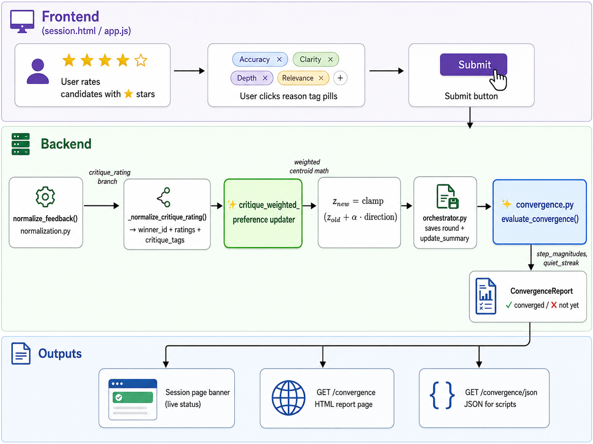
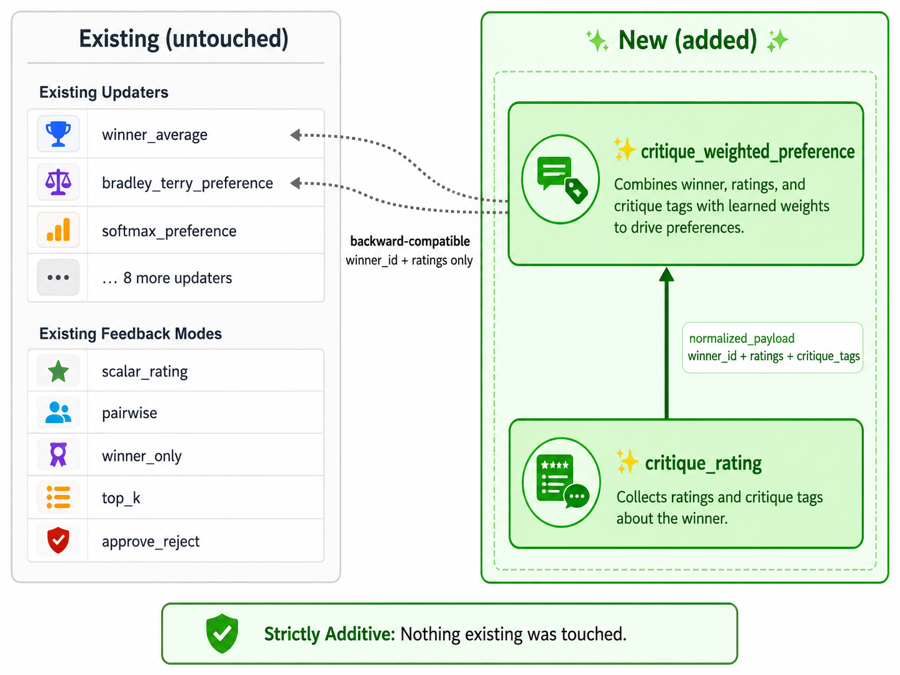

# Year 3 — AI Research Projects Summary

**Student:** Tomer Atia  
**Academic Year:** 2025–2026  
**Supervisor:** Dr. Sasha Apartsin

---

## Overview

This report summarizes two independent research projects completed during the third year of study. Both projects share a common theme: **using generative AI to solve real-world problems that cannot be addressed with standard data collection alone.**

| | Semester A | Semester B |
|---|---|---|
| **Project** | Autonomous Car Edge Case Detection | StableSteering — Preference-Guided Image Generation |
| **Core challenge** | Rare objects missing from training data | No signal for *why* a user prefers an image |
| **Generative AI role** | Synthesize missing training examples | Steer generation toward user preferences |
| **Key result** | Animal detection: 0% → 99.5% AP50 | Critique tags improve steering accuracy by 38% |
| **Repository** | [SyntheticImageData](https://github.com/HITProjects/SyntheticImageData/tree/main/ObjectsOrAnimals) | [StableSteering](https://github.com/Tomeratia/StableSteering) |

---

---

# Semester A — Autonomous Car Edge Case Detection
### Synthetic Animal Insertion for Robustness Testing of Autonomous Driving Perception

📁 **Full project repository:** [HITProjects/SyntheticImageData/ObjectsOrAnimals](https://github.com/HITProjects/SyntheticImageData/tree/main/ObjectsOrAnimals)

---

## Overview

This project addresses a critical gap in autonomous driving safety: **detecting rare, unexpected objects on the road** — specifically animals. Standard driving datasets (like KITTI) contain almost no animal examples, leaving perception models blind to this real-world hazard.

The solution is a **full generative augmentation pipeline** that:
1. Takes real KITTI driving images
2. Uses AI to detect the road surface and estimate scene depth
3. Generates photorealistic animals on the road via SDXL Inpainting + ControlNet
4. Trains and benchmarks YOLOv11s detectors with and without the synthetic data

> **The answer is clear: a model trained without synthetic data scores 0% on animal detection. A model trained with synthetic data scores 99.5% AP50 — on a class that never existed in the original dataset.**

---

## Pipeline Architecture

<p align="center"></p>

---

## Example Synthetic Images

Examples of animals generated by the SDXL + ControlNet pipeline, inserted onto real KITTI driving scenes:

<table>
  <tr>
    <td></td>
    <td></td>
  </tr>
  <tr>
    <td></td>
    <td></td>
  </tr>
</table>

---

## Background & Motivation

### The Long-Tail Problem in Autonomous Driving

Modern object detectors trained on standard datasets perform well on frequent categories (cars, pedestrians) but **fail catastrophically on rare edge cases**. Animals on roads are statistically rare in training data, visually diverse, and extremely safety-critical.

### Why SDXL + ControlNet?

| Approach | Pros | Cons |
|---|---|---|
| Copy-paste augmentation | Fast, simple | Unrealistic, no lighting integration |
| GAN-based synthesis | Good quality | Hard to control |
| Diffusion inpainting (no guidance) | Flexible | Ignores scene geometry |
| **SDXL + ControlNet Depth** | Realistic, depth-aware perspective | Slower, requires GPU |

Using depth maps as ControlNet conditioning ensures animals are **scaled correctly by distance**.

---

## Models

| Model | Training Data | Purpose |
|---|---|---|
| **M1** | COCO pretrained, no fine-tune | Zero-shot baseline |
| **M2** | KITTI real only | Domain-adapted, no animal data |
| **M3** | KITTI real + synthetic animals | Full augmented model |

---

## Results

### Core Result — Animal Detection (AP50)

| Model | Test-Mixed | Test-Synthetic |
|---|:---:|:---:|
| M1 (COCO base) | 0.1054 | 0.1055 |
| M2 (KITTI real) | 0.000 | 0.000 |
| **M3 (KITTI+synthetic)** | **0.995** | **0.995** |

> M2 scores **zero** — it has never seen an animal. M3 achieves **99.5% AP50**, entirely from synthetic training data.

### Overall Performance (mAP50)

| Model | Test-Clean | Test-Mixed | Test-Synthetic |
|---|:---:|:---:|:---:|
| M1 (COCO base) | 0.6463 | 0.5348 | 0.4436 |
| M2 (KITTI real) | 0.5613 | 0.4347 | 0.3710 |
| **M3 (+ synthetic)** | **0.5802** | **0.5598** | **0.4934** |

<p align="center"></p>

### Qualitative Comparison — M2 vs M3

<p align="center"></p>

M3 is the only model that detects animals on road (green box). M2 misses them entirely.

---

## Synthetic Data Statistics

| Split | Real images | Synthetic generated | Success rate |
|---|:---:|:---:|:---:|
| Train | 700 | 661 | 94.4% |
| Val | 150 | 135 | 90.0% |
| Test | 150 | 142 | 94.7% |
| **Total** | **1,000** | **938** | **93.8%** |

---

## Generation Pipeline

| Step | Model | Purpose |
|---|---|---|
| Road Segmentation | SAM 3 (`facebook/sam3`) | Define inpainting region |
| Depth Estimation | Depth Anything V2 Small | Perspective-aware sizing |
| Animal Generation | SDXL + ControlNet Depth | Photorealistic insertion |
| Quality Evaluation | ViT + Spectral (ensemble) | Validate realism |

---

## Key Findings — Semester A

- **Synthetic augmentation enables animal detection from zero** — this capability did not exist before.
- **Minimal regression on standard classes** (<2.5% average degradation).
- **Depth-guided generation produces perspective-correct results.**
- **SAM 3 road masking** correctly confines animal placement to drivable surfaces.

---

---

# Semester B — StableSteering: Preference-Guided Image Generation
### Convergence Detection & Critique-Assisted Feedback Mode

📁 **Full project repository:** [Tomeratia/StableSteering](https://github.com/Tomeratia/StableSteering)

---

## Overview

StableSteering is a FastAPI research platform for **iterative preference-guided image generation**. The core loop: a user submits a text prompt → candidates are generated via Stable Diffusion → the user provides feedback → a steering vector `z` is updated → the next round of candidates is generated.

This semester's contributions address two gaps explicitly listed in the supervisor's research roadmap:

| Feature | What it adds |
|---|---|
| **Convergence Detection** | Signals when a session has "settled" — no more guessing when to stop |
| **Critique-Assisted Feedback** | Captures *why* the user prefers a candidate, not just *which* one |

Both additions are **strictly additive** — no existing algorithm was modified. 102 original tests continue to pass, 8 new tests added: **110 passing tests total**.

```
Before                          After
──────────────────────────────────────────────────────────
5 feedback modes                6 feedback modes  (+critique_rating)
11 updaters                     12 updaters       (+critique_weighted_preference)
No convergence signal           Full convergence detection + UI
No strategy comparison study    18-session synthetic study with findings
102 tests                       110 tests
```

---

## System Architecture

<p align="center"></p>

---

## Feature 1 — Convergence Detection

The platform had no mechanism to tell when a steering session had "settled." Every session ran for a fixed number of rounds with no signal that the steering vector `z` had stopped meaningfully moving.

<p align="center"></p>

**Two independent convergence signals:**

| Signal | Triggered when |
|---|---|
| `step_below_threshold` | $\lVert z_t - z_{t-1} \rVert < \delta_{\min} \times r_{\text{trust}}$ for `patience` consecutive rounds |
| `incumbent_repeated` | User selects the same image for `patience` consecutive rounds |

**New API endpoints:**

| Endpoint | Returns |
|---|---|
| `GET /sessions/{id}/convergence` | HTML report page |
| `GET /sessions/{id}/convergence/json` | Raw JSON report |

---

## Feature 2 — Critique-Assisted Feedback Mode

All five existing feedback modes capture **which** candidate the user prefers. None captures **why**. This feature adds that missing dimension.

<p align="center"></p>

### The Algorithm

<p align="center"></p>

For each candidate $i$, compute a tag weight:

$$w_i = |\text{positive tags}_i| - |\text{negative tags}_i|$$

Compute centroids and update:

$$\mathbf{c}^{+} = \frac{\sum_{i:\, w_i > 0} w_i \cdot z_i}{\sum_{i:\, w_i > 0} w_i}, \qquad \mathbf{c}^{-} = \frac{\sum_{i:\, w_i < 0} |w_i| \cdot z_i}{\sum_{i:\, w_i < 0} |w_i|}$$

$$z_{\text{new}} = \text{clamp}\!\left(z_{\text{old}} + \alpha \cdot (\mathbf{c}^{+} - \mathbf{c}^{-}),\; r_{\text{trust}}\right)$$

### Comparison Study Results

**Setup:** 2 arms × 3 samplers × 3 seeds = 18 synthetic sessions.

```
Rounds to convergence               Final distance to target
────────────────────────────        ──────────────────────────────────
baseline_scalar   ████░░ 3.78       baseline_scalar   ████████████████ 0.337
critique_weighted ████████ 6.11     critique_weighted ██████████ 0.207
                                                      (lower = more accurate)
```

| Arm | % Converged | Mean rounds | Mean final distance |
|---|---:|---:|---:|
| `baseline_scalar` | 100% | **3.78** ← faster | 0.3365 |
| `critique_weighted` | 100% | 6.11 | **0.2069** ← 38% more accurate |

---

## Key Findings — Semester B

- **Convergence detection enables reproducible stopping criteria.**
- **Critique tags change the mathematical trajectory of z** — proven by unit test and 18-session study.
- **Speed vs. accuracy tradeoff**: critique mode takes more rounds but reaches 38% closer to the target.
- **All 11 existing updaters remain backward-compatible.**

---

---

# Cross-Semester Themes

| Theme | Semester A | Semester B |
|---|---|---|
| **Generative AI as a research tool** | SDXL generates missing training data | Stable Diffusion steered by user preference |
| **Measuring what didn't exist before** | Animal AP50: 0 → 0.995 | Critique accuracy: +38% |
| **Additive, non-destructive design** | New pipeline alongside existing training | New updater alongside 11 existing algorithms |
| **Empirical validation** | 3-model × 3-testset matrix | 18-session synthetic study |
| **Honest results** | Reports regression alongside gains | Reports speed cost alongside accuracy gain |

---

## References

### Semester A
- Geiger et al. (2013). **The KITTI dataset.** *IJRR.*
- Podell et al. (2023). **SDXL.** *arXiv:2307.01952.*
- Zhang et al. (2023). **ControlNet.** *ICCV 2023.*
- Carion et al. (2025). **SAM 3.** *arXiv:2511.16719.*
- Yang et al. (2024). **Depth Anything V2.** *arXiv:2406.09414.*
- Ultralytics. (2024). **YOLOv11.**

### Semester B
- Rombach et al. (2022). **Latent diffusion models.** *CVPR 2022.*
- StableSteering platform — `ApartsinProjects/StableSteering`

---

*Tomer Atia — Year 3, 2025–2026*
