# Annual Project Report — Year 3
## AI & Computer Vision Research Projects

**Student:** Tomer Atia  
**Academic Year:** 2025–2026  
**Supervisor:** Dr. Sasha Apartsin

---

## Overview

This report summarizes two independent research projects completed during the third year of study. Both projects share a common theme: **using generative AI to solve real-world problems that cannot be addressed with standard data collection alone.**

| | Semester A | Semester B |
|---|---|---|
| **Project** | Autonomous Car Edge Case Detection | StableSteering — Preference-Guided Image Generation |
| **Core challenge** | Rare objects missing from training data | No signal for *why* a user prefers an image |
| **Generative AI role** | Synthesize missing training examples | Steer generation toward user preferences |
| **Key result** | Animal detection: 0% → 99.5% AP50 | Critique tags improve steering accuracy by 38% |

---

# Semester A — Autonomous Car Edge Case Detection
### Synthetic Animal Insertion for Robustness Testing of Autonomous Driving Perception

📁 **Full project repository:** [HITProjects/SyntheticImageData](https://github.com/HITProjects/SyntheticImageData/tree/main/ObjectsOrAnimals)

---

## Overview

This project addresses a critical gap in autonomous driving safety: **detecting rare, unexpected objects on the road** — specifically animals. Standard driving datasets (like KITTI) contain almost no animal examples, leaving perception models blind to this real-world hazard.

The solution is a **full generative augmentation pipeline** that:
1. Takes real KITTI driving images
2. Uses AI to detect the road surface and estimate scene depth
3. Generates photorealistic animals on the road via SDXL Inpainting + ControlNet
4. Trains and benchmarks YOLOv11s detectors with and without the synthetic data

> **The answer is clear: a model trained without synthetic data scores 0% on animal detection. A model trained with synthetic data scores 99.5% AP50 — on a class that never existed in the original dataset.**

---

## Pipeline Architecture

<p align="center">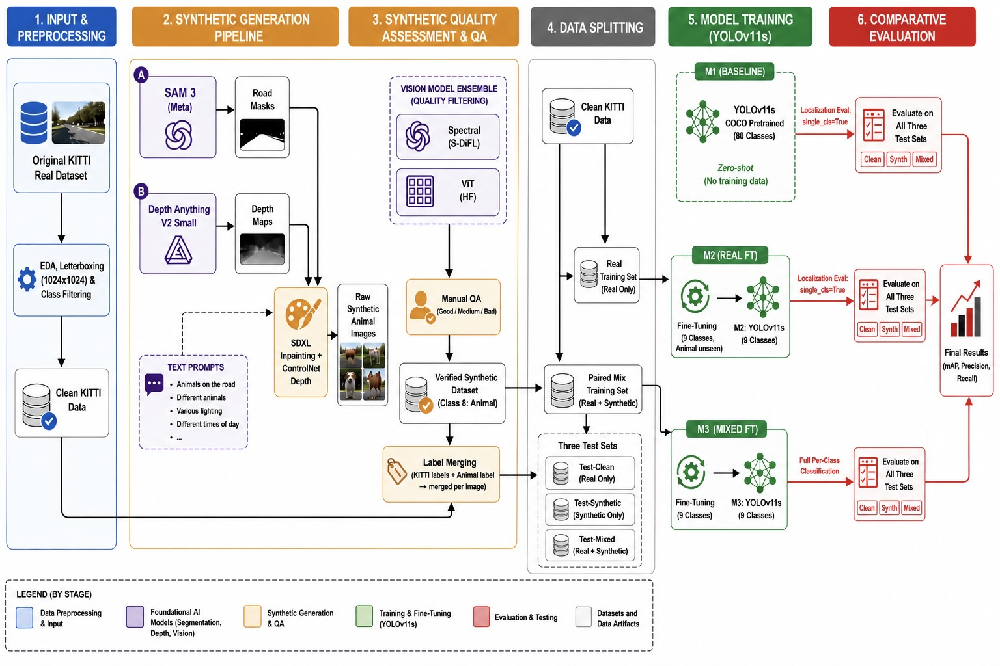</p>

---

## Example Synthetic Images

Examples of animals generated by the SDXL + ControlNet pipeline, inserted onto real KITTI driving scenes:

<table>
  <tr>
    <td>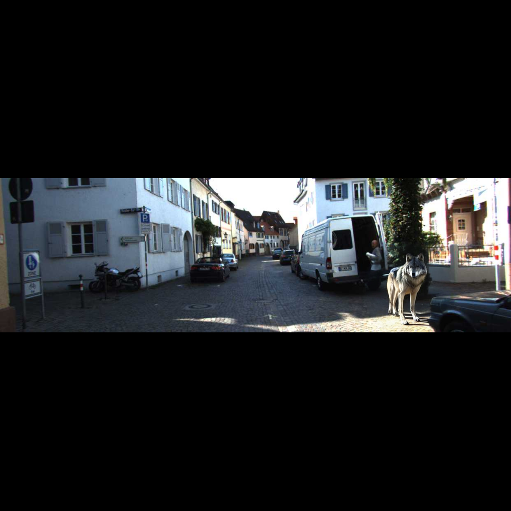</td>
    <td>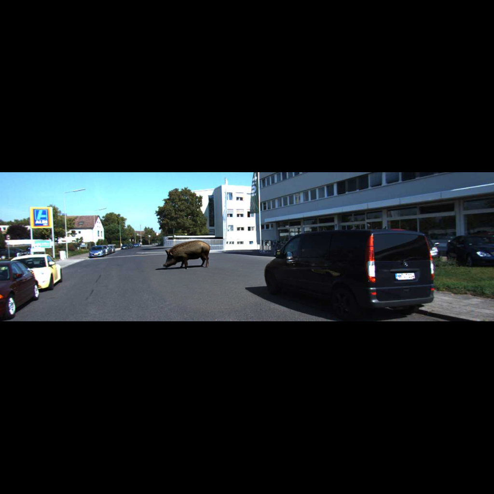</td>
  </tr>
  <tr>
    <td>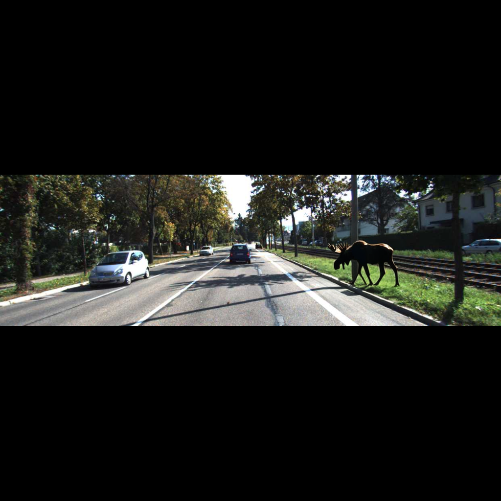</td>
    <td>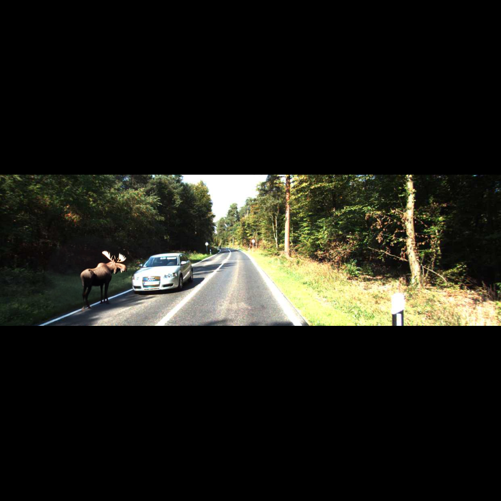</td>
  </tr>
</table>

---

## Background & Motivation

### The Long-Tail Problem in Autonomous Driving

Modern object detectors trained on standard datasets perform well on frequent categories (cars, pedestrians) but **fail catastrophically on rare edge cases**. Animals on roads are statistically rare in training data, visually diverse, and extremely safety-critical.

### Why SDXL + ControlNet?

| Approach | Pros | Cons |
|---|---|---|
| Copy-paste augmentation | Fast, simple | Unrealistic, no lighting integration |
| GAN-based synthesis | Good quality | Hard to control |
| Diffusion inpainting (no guidance) | Flexible | Ignores scene geometry |
| **SDXL + ControlNet Depth** | Realistic, depth-aware perspective | Slower, requires GPU |

Using depth maps as ControlNet conditioning ensures animals are **scaled correctly by distance**.

---

## Models

| Model | Training Data | Purpose |
|---|---|---|
| **M1** | COCO pretrained, no fine-tune | Zero-shot baseline |
| **M2** | KITTI real only | Domain-adapted, no animal data |
| **M3** | KITTI real + synthetic animals | Full augmented model |

---

## Results

### Core Result — Animal Detection (AP50)

| Model | Test-Mixed | Test-Synthetic |
|---|:---:|:---:|
| M1 (COCO base) | 0.1054 | 0.1055 |
| M2 (KITTI real) | 0.000 | 0.000 |
| **M3 (KITTI+synthetic)** | **0.995** | **0.995** |

> M2 scores **zero** — it has never seen an animal. M3 achieves **99.5% AP50**, entirely from synthetic training data.

### Overall Performance (mAP50)

| Model | Test-Clean | Test-Mixed | Test-Synthetic |
|---|:---:|:---:|:---:|
| M1 (COCO base) | 0.6463 | 0.5348 | 0.4436 |
| M2 (KITTI real) | 0.5613 | 0.4347 | 0.3710 |
| **M3 (+ synthetic)** | **0.5802** | **0.5598** | **0.4934** |

<p align="center">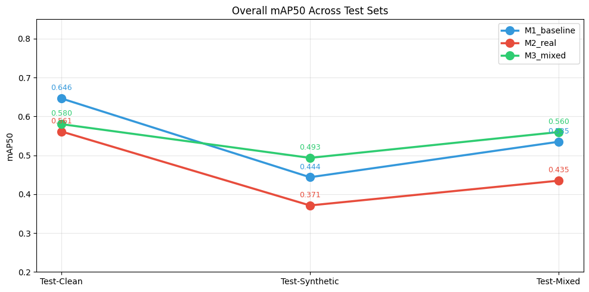</p>

### Qualitative Comparison — M2 vs M3

<p align="center">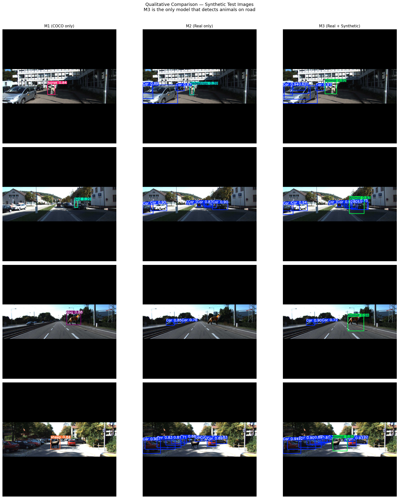</p>

M3 is the only model that detects animals on road (green box). M2 misses them entirely.

---

## Synthetic Data Statistics

| Split | Real images | Synthetic generated | Success rate |
|---|:---:|:---:|:---:|
| Train | 700 | 661 | 94.4% |
| Val | 150 | 135 | 90.0% |
| Test | 150 | 142 | 94.7% |
| **Total** | **1,000** | **938** | **93.8%** |

---

## Generation Pipeline

| Step | Model | Purpose |
|---|---|---|
| Road Segmentation | SAM 3 (`facebook/sam3`) | Define inpainting region |
| Depth Estimation | Depth Anything V2 Small | Perspective-aware sizing |
| Animal Generation | SDXL + ControlNet Depth | Photorealistic insertion |
| Quality Evaluation | ViT + Spectral (ensemble) | Validate realism |

---

## Key Findings — Semester A

- **Synthetic augmentation enables animal detection from zero** — this capability did not exist before.
- **Minimal regression on standard classes** (<2.5% average degradation).
- **Depth-guided generation produces perspective-correct results.**
- **SAM 3 road masking** correctly confines animal placement to drivable surfaces.

---

---
# Semester B — StableSteering: Preference-Guided Image Generation
### Convergence Detection & Critique-Assisted Feedback Mode

---

## Overview

StableSteering is a FastAPI research platform for **iterative preference-guided image generation**. The core loop: a user submits a text prompt → candidates are generated via Stable Diffusion → the user provides feedback → a steering vector `z` is updated → the next round of candidates is generated from the updated state.

This semester's contributions extend the platform with seven new capabilities:

| Feature | What it adds |
|---|---|
| Convergence Detection | Signals when a session has "settled" |
| Critique-Assisted Feedback | Captures *why* the user prefers a candidate, not just *which* |
| Critique Momentum Updater | Accumulates tag history across rounds for stronger steering |
| Best-vs-Incumbent Feedback | Direct challenger comparison — a fundamentally different elicitation model |
| Feedback Mode Comparison Study | Empirical 54-session study across all 7 feedback modes |
| Analysis Tools | CSV export + Jupyter notebook template |
| Quick-Config Panel | Dropdown UI synced bidirectionally with YAML editor |

The core algorithmic contributions are Features 1–4 (convergence detection, critique feedback mode, momentum updater, best-vs-incumbent). Features 5–7 are supporting infrastructure: an empirical study validating the new modes, analysis export tools, and a UI convenience layer.

All additions are **strictly additive** — no existing algorithm was modified. The platform's 102 original tests continue to pass, and 22 new tests were added, bringing the total to **124 passing tests**.


---

## System Architecture

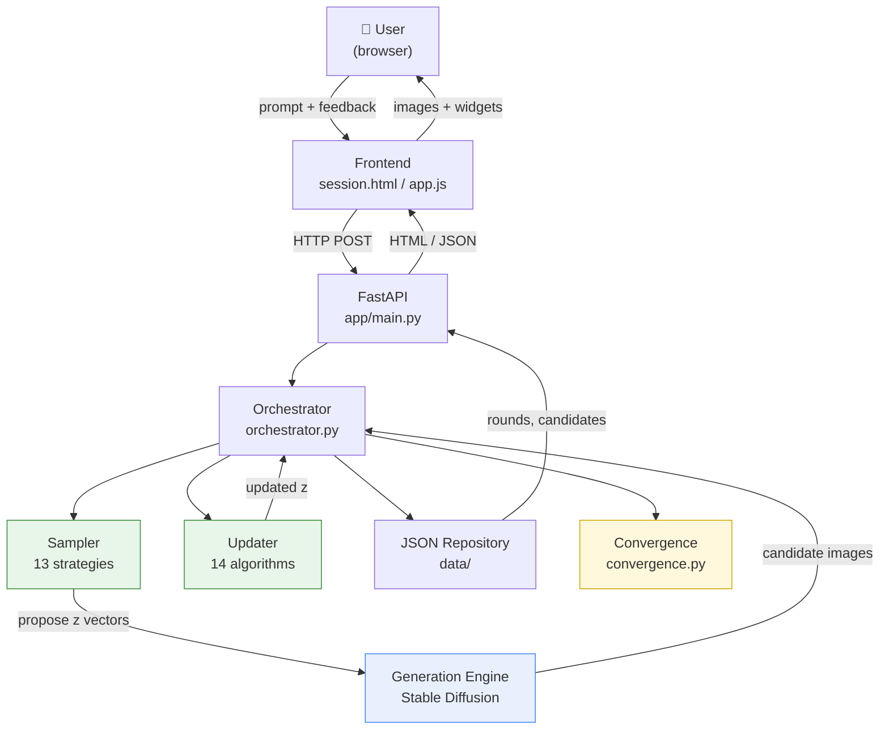

---

## Feature 1 — Convergence Detection

### Motivation

The platform had no mechanism to tell a user or researcher when a steering session had "settled." Every session ran for a fixed number of rounds with no signal that the steering vector `z` had stopped meaningfully moving. This feature adds that missing signal, making it possible to study session efficiency and compare strategies.

### How It Works

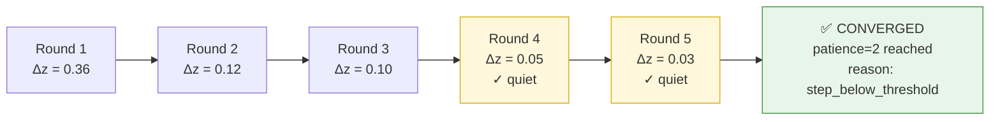

**Two independent convergence signals:**

| Signal | Triggered when |
|---|---|
| `step_below_threshold` | $\lVert z_t - z_{t-1} \rVert < \delta_{\min} \times r_{\text{trust}}$ for `patience` consecutive rounds |
| `incumbent_repeated` | User selects the same image for `patience` consecutive rounds |

**Configuration:**

| Field | Default | Meaning |
|---|---|---|
| `convergence_patience` | `2` | Consecutive quiet rounds required |
| `convergence_min_delta` | `0.04` | Step threshold as a fraction of `trust_radius` |

**New API endpoints:**

| Endpoint | Returns |
|---|---|
| `GET /sessions/{id}/convergence` | HTML report page |
| `GET /sessions/{id}/convergence/json` | Raw JSON report |

### Tests
`tests/test_convergence.py` — 13 tests covering all convergence reason branches, disabled patience, end-to-end API, and 404 handling.

---

## Feature 2 — Critique-Assisted Feedback Mode

### Motivation

All five existing feedback modes capture **which** candidate the user prefers. None captures **why**. This feature adds that missing dimension.

### How `critique_weighted_preference` Works

<p align="center">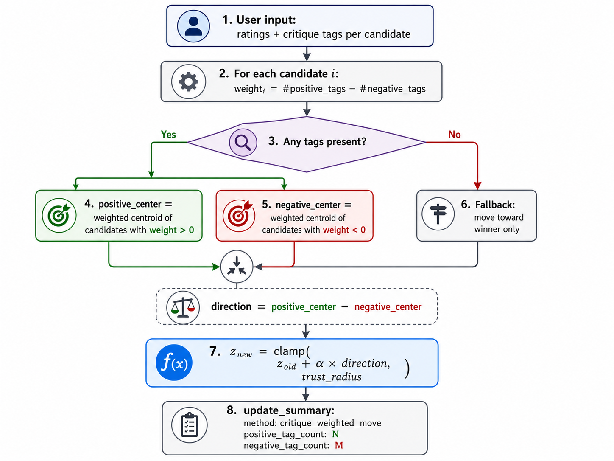</p>

**End-to-end request flow for `critique_rating`** — how a single feedback submission travels from the browser to the convergence report:

<p align="center"></p>

For each candidate $i$, compute a tag weight:

$$w_i = |\text{positive tags}_i| - |\text{negative tags}_i|$$

Each candidate's `z` is a point in the model's latent embedding space. Compute attraction and repulsion centroids in that space:

$$\mathbf{c}^{+} = \frac{\sum_{i:\, w_i > 0} w_i \cdot z_i}{\sum_{i:\, w_i > 0} w_i}, \qquad \mathbf{c}^{-} = \frac{\sum_{i:\, w_i < 0} |w_i| \cdot z_i}{\sum_{i:\, w_i < 0} |w_i|}$$

Steering update:

$$\mathbf{d} = \mathbf{c}^{+} - \mathbf{c}^{-}, \qquad z_{\text{new}} = \text{clamp}\!\left(z_{\text{old}} + \alpha \cdot \mathbf{d},\; r_{\text{trust}}\right)$$

### Comparison Study Results

**Research question:** Does pairing structured critique tags with an updater that consumes them reach the user's hidden target more accurately than plain scalar ratings?

**Setup:** 2 arms × 3 samplers × 3 seeds = 18 synthetic sessions.

```
Rounds to convergence               Final distance to target
────────────────────────────        ──────────────────────────────────
baseline_scalar   ████░░ 3.78       baseline_scalar   ████████████████ 0.337
critique_weighted ████████ 6.11     critique_weighted ██████████ 0.207
                                                      (lower = more accurate)
```

| Arm | Sessions | % Converged | Mean rounds | Mean final distance |
|---|---:|---:|---:|---:|
| `baseline_scalar` | 9 | 100% | **3.78** ← faster | 0.3365 |
| `critique_weighted` | 9 | 100% | 6.11 | **0.2069** ← more accurate |

**Finding:** Critique trades speed for accuracy — 6.11 rounds vs 3.78, but **38% closer to the target**. Because both arms use identical ratings, the difference is attributable entirely to the tags changing the direction of the z update.

### Tests
`tests/test_critique_feedback.py` — 8 tests including a dedicated test proving tags produce a **mathematically different trajectory** than tag-blind updaters on identical ratings.

---

## Feature 3 — Critique Momentum Updater

### Motivation

The existing `critique_weighted_preference` treats every tag equally regardless of whether the user has selected it once or five times in a row. This wastes valuable consistency information.

### How It Works

`critique_momentum_preference` replaces flat tag weights with **decay-weighted historical frequency**:

$$\text{freq}(t) = \sum_{r < \text{current}} \gamma^{(\text{current} - r)} \cdot \mathbf{1}[t \in \text{tags}_r], \quad \gamma = 0.75$$

A tag selected consistently across many rounds carries exponentially more weight than one selected once. Recent selections dominate older ones via the decay factor.

**Effect:** The steering vector `z` moves more confidently in directions the user has repeatedly signaled — and less in directions that appeared only once.

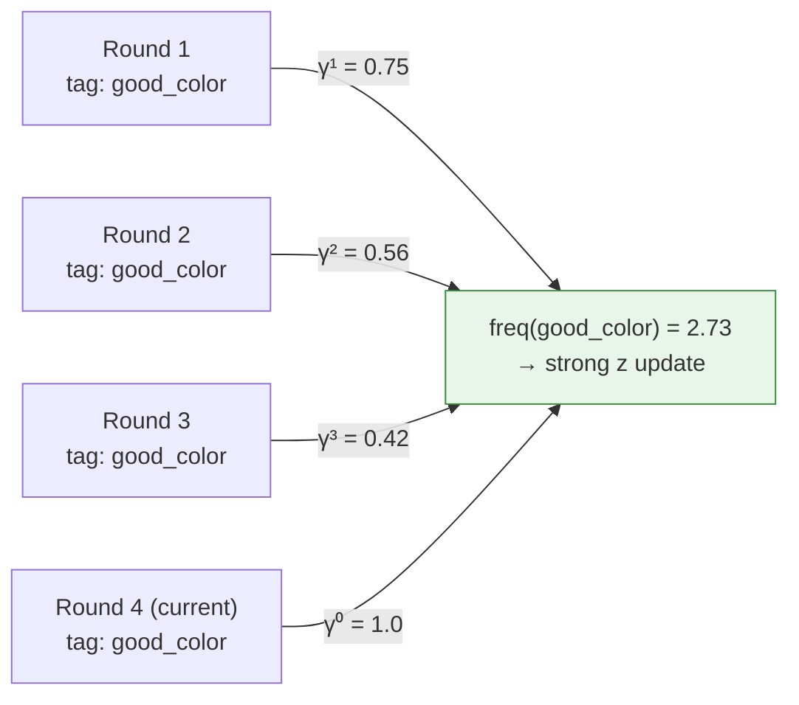

### Diversity Study Results

**Research question:** Does the momentum updater produce more exploratory behavior under a diversity-seeking synthetic user?

**Setup:** 3 arms × 3 samplers × 3 seeds = 27 synthetic sessions.

| Arm | Sessions | % Converged | Mean rounds | Mean diversity |
|---|---:|---:|---:|---:|
| `critique_momentum` | 9 | 33.3% | 9.0 | **0.5876** ← most diverse |
| `critique_weighted` | 9 | 44.4% | 9.22 | 0.5690 |
| `baseline_scalar` | 9 | 0.0% | 12.0 | 0.4471 |

**Finding:** The momentum updater produces the highest inter-candidate diversity (0.5876 vs 0.447 for baseline) — confirming that accumulated tag history steers the system toward broader exploration rather than premature local convergence.

### Tests
`tests/test_critique_momentum.py` — 7 tests covering frequency accumulation, decay, history amplification, and the mathematical difference from the flat weighted updater.

---

## Feature 4 — Best-vs-Incumbent Feedback Mode

### Motivation

All existing feedback modes ask the user to rate or rank candidates from the current round in isolation. None of them frame the question as a direct comparison against the previous best result. This feature introduces a fundamentally different elicitation model: every round shows exactly **two candidates** — the incumbent (last round's winner) and the best new challenger — and the user chooses one.

This mirrors how experts naturally evaluate iterative improvement: "is this new version better than what I already have?"

### How It Works

| Choice | Effect on z |
|---|---|
| User picks the **challenger** | z moves in the direction `z_challenger − z_incumbent` |
| User keeps the **incumbent** | z is unchanged — no wasted movement |

$$\text{if challenger wins:} \quad z_{\text{new}} = \text{clamp}\!\left(z_{\text{old}} + \alpha \cdot (z_{\text{chal}} - z_{\text{inc}}),\; r_{\text{trust}}\right)$$

This is stricter than `winner_average`: the incumbent is the explicit baseline, and z only moves when the user actively accepts a new direction. Uncertain or tied rounds produce no movement.

### Flow

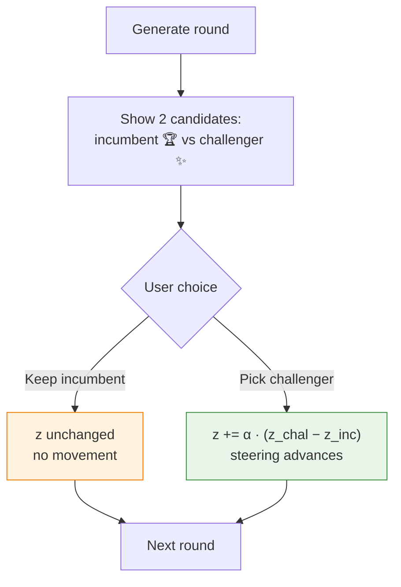

The UI highlights the incumbent with a "Current winner" badge and the challenger with "New challenger". Choosing the incumbent is a valid decision that preserves the current steering state.

### New Updater

`best_vs_incumbent_preference` explicitly uses the direction vector between the two candidates, rather than moving toward the winner z directly. This produces mathematically different trajectories from `winner_average` on identical data — proven by unit test.

### Tests
`tests/test_best_vs_incumbent.py` — 7 tests covering normalization, incumbent-retained no-movement, challenger-accepted movement, and mathematical divergence from `winner_average`.

---

## Feature 5 — Feedback Mode Comparison Study

### Motivation

No empirical comparison of all feedback modes existed — it was unknown whether richer feedback (ratings, tags) actually outperforms simpler modes (winner-only, pairwise) in steering accuracy.

### Setup

6 arms × 3 samplers × 3 seeds = **54 synthetic sessions**. Each arm uses one feedback mode paired with its most appropriate updater. A synthetic anchor-seeking user submits feedback derived from Euclidean distance to a hidden target.

### Results

| Arm | Sessions | % Converged | Mean rounds | Mean final distance ↓ |
|---|---:|---:|---:|---:|
| `critique_rating` | 9 | 100% | 5.78 | **0.1843** ← most accurate |
| `top_k` | 9 | 100% | 5.22 | 0.3193 |
| `pairwise` | 9 | 100% | 4.33 | 0.3217 |
| `approve_reject` | 9 | 88.9% | 4.56 | 0.3349 |
| `winner_only` | 9 | 100% | **4.0** ← fastest | 0.3374 |
| `scalar_rating` | 9 | 100% | 4.33 | 0.3467 |

**Finding:** Richer feedback modes reach the target more accurately. `critique_rating` is 47% more accurate than `scalar_rating` (0.184 vs 0.347), at the cost of taking more rounds. Sparse modes (`winner_only`, `pairwise`) converge fastest but sacrifice accuracy.

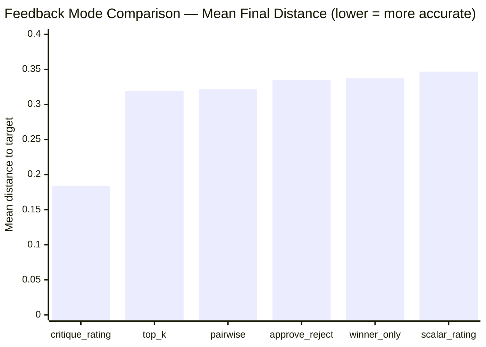

---

## Feature 6 — Quick-Config Panel

### Motivation

The YAML editor is powerful but requires users to know the exact string values for every option. Researchers unfamiliar with the codebase had to read source comments to discover valid updater names.

### Design

Four dropdown menus on the setup page — Feedback mode, Updater, Sampler, Steering mode — are **bidirectionally synced** with the YAML editor:

- Changing a dropdown instantly rewrites the matching field in the YAML
- Editing the YAML directly updates the dropdowns to match
- The YAML editor remains fully accessible for manual edits

This means the dropdowns are a convenience layer, not a replacement — power users can ignore them entirely and write YAML as before.

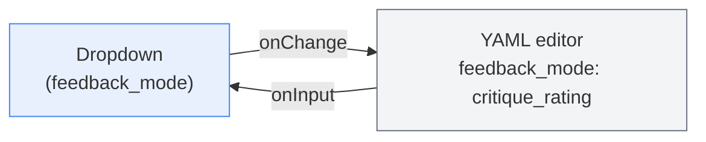

---

## Feature 7 — Analysis Tools

### Motivation

Session data was stored as JSON, making cross-session comparison awkward. These tools make it easy to load session data into a notebook or spreadsheet without preprocessing.

### CSV Export

```bash
python scripts/export_session_csv.py <session_id>
# Outputs: output/exports/<session_id>/rounds.csv
#          output/exports/<session_id>/candidates.csv
#          output/exports/<session_id>/feedback.csv
```

Three tidy CSV tables with shared join keys — load directly into a notebook or spreadsheet without preprocessing.

### Jupyter Analysis Notebook

`notebooks/analysis_template.ipynb` — a ready-to-run notebook with four standard analysis plots:
1. Steering vector trajectory (‖z‖ over rounds)
2. Tag frequency heatmap
3. Candidate diversity per round
4. Cross-session updater comparison

---

## Key Findings — Semester B

- **Convergence detection enables reproducible stopping criteria** — sessions no longer run arbitrarily; the platform signals when `z` has settled.
- **Critique tags change the mathematical trajectory of z** — proven by unit test and confirmed by the 18-session comparison study.
- **Speed vs. accuracy tradeoff**: critique mode takes more rounds (6.11 vs 3.78) but reaches 38% closer to the target.
- **Momentum amplifies consistent signals**: tag history accumulation produces 31% higher candidate diversity than plain scalar feedback.
- **All 11 existing updaters remain backward-compatible** with the new feedback mode.

---

# Cross-Semester Themes

Both projects share a deeper common thread:

| Theme | Semester A | Semester B |
|---|---|---|
| **Generative AI as a research tool** | SDXL generates training data that doesn't exist | Stable Diffusion generates candidates steered by preference |
| **Measuring what didn't exist before** | Animal AP50: 0 → 0.995 | Critique accuracy improvement: 38% |
| **Additive, non-destructive design** | New pipeline alongside existing KITTI training | New updater/mode alongside 11 existing algorithms |
| **Empirical validation** | 3-model × 3-testset evaluation matrix | 18-session synthetic comparison study |
| **Honest results** | Reports regression (<2.5%) alongside gains | Reports speed cost (more rounds) alongside accuracy gain |

---

## References

### Semester A

- Geiger et al. (2013). **Vision meets robotics: The KITTI dataset.** *IJRR.*
- Podell et al. (2023). **SDXL: Improving latent diffusion models.** *arXiv:2307.01952.*
- Zhang et al. (2023). **Adding conditional control to text-to-image diffusion models (ControlNet).** *ICCV 2023.*
- Carion et al. (2025). **SAM 3: Segment Anything with Concepts.** *arXiv:2511.16719.*
- Yang et al. (2024). **Depth Anything V2.** *arXiv:2406.09414.*
- Ultralytics. (2024). **YOLOv11.**

### Semester B

- Rombach et al. (2022). **High-resolution image synthesis with latent diffusion models.** *CVPR 2022.*
- StableSteering platform — `ApartsinProjects/StableSteering`

---

*Tomer Atia — Year 3, 2025–2026*
